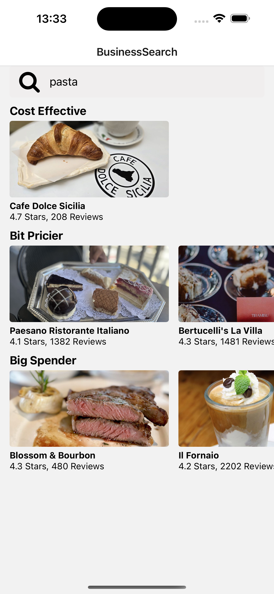

# React Native Yelp API Practice App

This is a simple React Native app that fetches data from the **Yelp API** and displays restaurants categorized by their price range: `$`, `$$`, and `$$$`. Users can tap on each restaurant to view more detailed information.

## ✨ Features

- Fetches restaurant data using the Yelp API
- Displays restaurants grouped by price:
  - `$` – Cost Effective
  - `$$` – Bit Pricier
  - `$$$` – Big Spender
- Users can tap on a restaurant to view more details
- Built using:
  - React Native
  - JavaScript
  - React Navigation (Stack)

## 🛠 Tech Stack

- [React Native](https://reactnative.dev/)
- [JavaScript](https://developer.mozilla.org/en-US/docs/Web/JavaScript)
- [React Navigation](https://reactnavigation.org/)
- [Yelp API](https://business.yelp.com/)

---

## 📸 Screenshots

| Search Screen | Details Screen |
|-------------|----------------|
|  |  |


---

## 📦 Installation

1. Clone this repository:

   ```bash
   git clone https://github.com/your-username/react-native-yelp-practice.git
   cd react-native-yelp-practice
